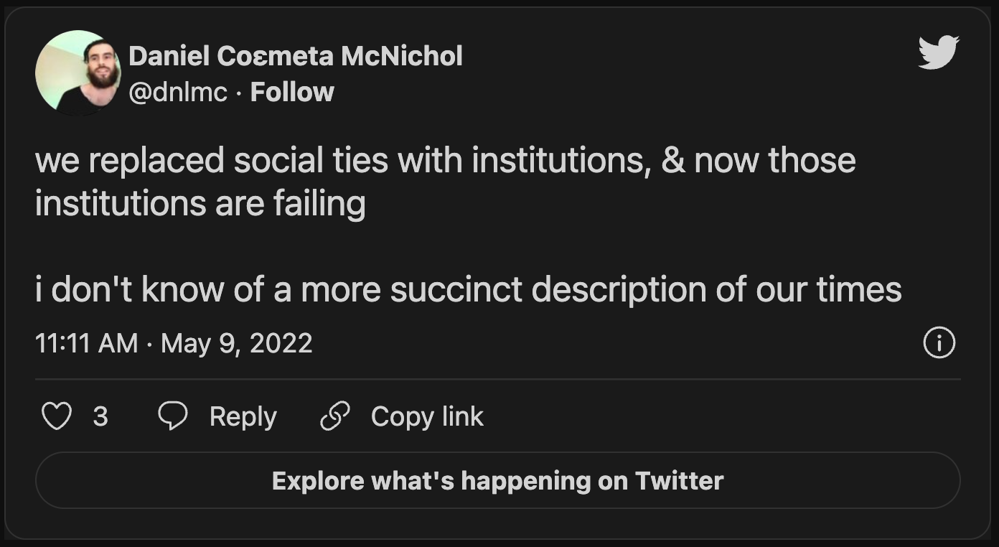
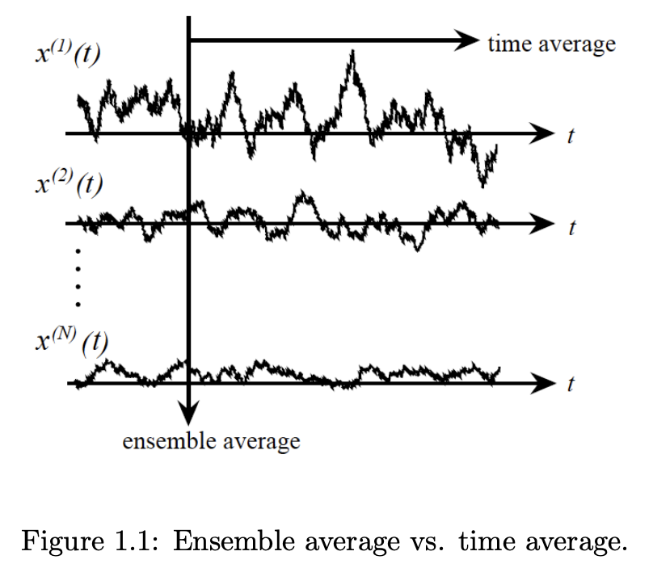
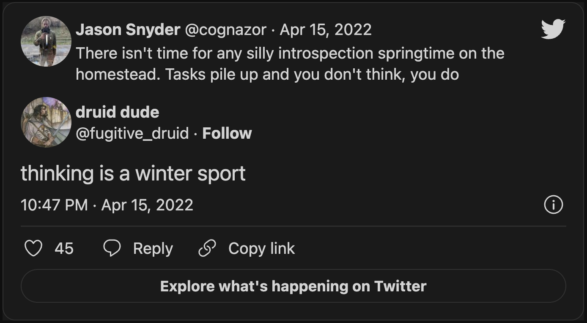
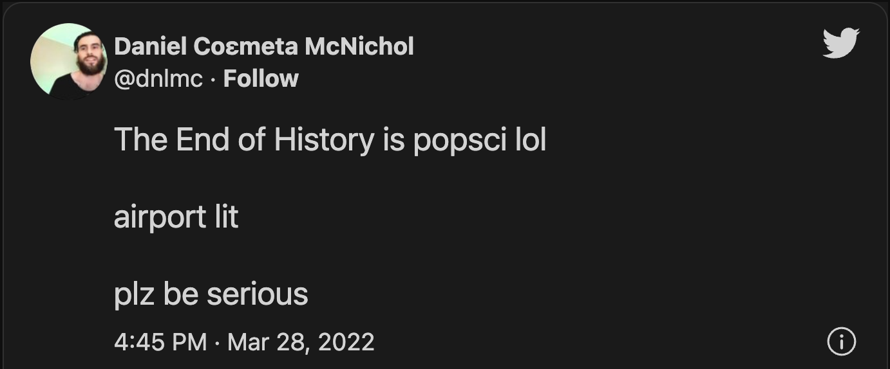

# Coεmeta Public Work Log 2022.1.MSU — Cultivation & Harvest Szn  <!-- omit in toc -->

## Midsummer Solstice Update (6/21/2022): building capacity, sowing & reaping in work & relation   <!-- omit in toc -->
> This is the second [Public Work Log](https://github.com/coemeta/public-work-log/) entry for [Coεmeta](https://coemeta.xyz/), a Public Benefit company providing data & sensemaking services with positive externalities. It's intended as a window into our journey & playbook as it develops, in the spirit of [working in public](https://nesslabs.com/work-in-public), contributing to [knowledge commons](https://en.wikipedia.org/wiki/Knowledge_commons), "finding the others" & leaving a trail + some resources for those that follow. I hope it inspires more folks to follow a similarly rewarding path & find similar (if modest & provisional) success. Feel free to [reach out](mailto:daniel@coemeta.com) at any time, I'm happy to help however I can!  

**_- Daniel McNichol_**__, founder & Chief Data Scientist__

 

_This post is mirrored at: [Github](https://github.com/coemeta/public-work-log) (primary source & version control) & [Roam](https://roamresearch.com/#/app/coemeta/page/mkxDLqzZy) (navigable outline format)_  

_...comments, forks & pull requests are welcome!_  

   

_It complements our [Open Source Strategy repo](https://github.com/coemeta/open-source-strategy), which offers more discrete, version-controlled resources related to the strategies & frameworks discussed here in more narrative form._  

   

> _This work is licensed under a [Creative Commons Attribution 4.0 International License](http://creativecommons.org/licenses/by/4.0/)_  

  

   

> 🙏🏼 Support Coεmeta's public benefit work with a donation via [ko-fi](https://ko-fi.com/coemeta) or [paypal](https://www.paypal.com/donate/?hosted_button_id=7W4M66QGW3LT8)!  

   

---  

## Contents
- [📜 Prologue: backstory & antecedents](#-prologue-backstory--antecedents)
    - [Backstory](#backstory)
    - [Antecedents & adumbration](#antecedents--adumbration)
- [⏳ Timeline](#-timeline)
- [꩜ Coda: eval & checkout](#-coda-eval--checkout)
    - [Eval](#eval)
    - [Vibe Check](#vibe-check)

---  

   

💡 *click headings to expand sections, then the **Contents** links above will work*

 

# 📜 Prologue: backstory & antecedents  

### Backstory  

**_Coεmeta_** is an attempt at an [infinite game](https://en.wikipedia.org/wiki/Finite_and_Infinite_Games). **The goal of infinite games is not to win, but to keep playing. **  

I consider this the _metagame_ (as opposed to endgame):   
>*a more **balanced**, **integrated**, **enriching** & **impactful** life in **greater community***

 

To pursue this metagame indefinitely (aka "infinitely"), I needed to reclaim some agency & autonomy in my work. So Coεmeta is also currently a [Pennsylvania Public Benefit LLC](https://coemeta.notion.site/coemeta/Co-meta-co-eh-meta-Data-Sensemaking-Services-9b764a49e7644703a64eda8f95084156#b97ace661ee84e81816b67d947ddbf53), serving as a vehicle for more traditional freelance & consulting work, as well as broader public-benefit oriented activities.  

> _(My longer-term vision for Coεmeta as a formal entity is something more like a _[worker-owned cooperative](https://institute.coop/what-worker-cooperative)_ or _[DAO](https://en.wikipedia.org/wiki/Decentralized_autonomous_organization)_ with shared collective ownership, or at least part of a federated network of _[mutual aid](https://en.wikipedia.org/wiki/Mutual_aid_%28organization_theory%29)_ & partnerships with other "self-sovereign"_ **ᵋ** _groups or entities. This is part of the "in greater community" aspect of the metagame.)_  

 

So **Coεmeta is not exactly a traditional 'venture' or typical small business or startup etc**, but assumes some of those trappings for now. The [previous log entry](2022.0.veu.md) recaps more of the motivations & considerations underlying all of this, & our [Open Source Strategy repo](https://github.com/coemeta/open-source-strategy) describes some of the strategic planning & wayfinding models used so far.   

 

As elaborated throughout these artifacts, **public work & contributing to knowledge commons are core parts of the overall metagame strategy & ethos**. So these posts are part of that: figuring it out as I go, learning while doing, in public. This entry picks up where the previous left off. (The timing & titles of the first two entries should make the intended heliocentric publishing cadence clear.)  

 

ᵋ NB: I'm generally skeptical of this terminology & its associations with neoliberal / libertarian fantasies of fully atomized "[sovereign individuals](https://www.radicalxchange.org/media/blog/sovereign-nonsense/)", but "independent" isn't quite adequate either.  

 

### Antecedents & adumbration  

In the **[previous entry](/2022.0.veu.md)**, I **[discussed](2022.0.veu.md#vibe-check) feeling good about finding some of the greater balance I was seeking**, along with a **more integrated, rewarding & palpably impactful** work life. I discussed my **gratitude for this provisional success**, which was **mostly due to luck & the kindness of others**. And I mentioned looking forward to **shifting to more of an outward focus,** enabling clients & collaborators to be more impactful, & **growing mutual capacities together**.  

 

In this entry, I'm happy to report on some **progress towards that outward focus & mutual capacity-building**, as well as **new opportunities again arising primarily from luck & the kindness of others**.   

I also discuss how **some of that prior balance has given way to seizing these opportunities** (or at least has been stretched over a longer timescale). I also note a **growing salience of looming risks & shadows**, but how I'm nevertheless **looking forward to continued cultivation & harvest**, & wrestling with ideas of **further scaling (or sporing)** these efforts for **greater impact & a greater common good**. 

 

# ⏳ Timeline 

 

_A brief timeline of relevant events, from the vernal equinox of Mar 2022, to the time of writing on the midsummer solstice of Jun 21, 2022._   

_(see prior timeline [here](2022.0.veu.md#⏳-timeline), or the full timeline to-date [here](https://roamresearch.com/#/app/coemeta/page/EkP-exB0L))_

 

 

**Mar 2022** (post-equinox)  

  - **[Contribute](https://github.com/duckdb/duckdb-web/pull/193) to [DuckDB docs](https://github.com/duckdb/duckdb-web)** after exploring the [trending open source in-process database](https://duckdb.org/) – sort of an OLAP SQLite. _Trying to be a good open source citizen & get some practice with proper open source contributions._  
  - 

Figure out <b>estimated quarterly taxes</b> for the first time (with this endeavor), which was MOSTLY fine...

    - ...with the exception of [Philadelphia's odd & onerous additional layers of business / self-employment taxes](https://www.inquirer.com/business/philadelphia-business-taxes-regulations-rank-talent-amazon-20201122.html), which as of writing in June I've still not succeeded in fully submitting, despite months of emails (mostly ignored for weeks at a time) & hours on hold with the Revenue Department, who would ultimately tell me I needed to send an email.  
    - TLDR: my initial tax account was set up incorrectly as a corporation, & I was able to pay [BIRT](https://www.phila.gov/services/payments-assistance-taxes/business-taxes/business-income-receipts-tax-birt/) (fka "Business Privilege Tax") through their new web portal, to which all previous online resources now redirect in a Kafkaesque labyrinth of live & dead links. However to submit [NPT](https://www.phila.gov/services/payments-assistance-taxes/business-taxes/net-profits-tax/) (which corporations don't pay), my account needed to be recreated as a disregarded entity (essentially a pass-through to me as an individual), which required a new form, & resulted in my old account & BIRT account being closed. Leaving me in this current state: unsure if my past BIRT payment will be recognized as applying to my new account, & still unable to figure out how to submit BIRT & NPT payments under the new account. After explaining the situation & open questions (+ several unanswered followups over 4 weeks), I received this cryptic reply:  
    - > Thank you for contacting The Philadelphia Department of Revenue.  The NPT account XX-XXXXXXXXX was open under the PTID of XXXXXXXXXXXX.   COEMETA LLC XXXXXXXXXXX is listed as a Disregarded Entity.  We are marking your email as resolved. If you have more questions, please feel free to email us back for help.  
    - Entirely unsure what to do with this information, I decided I'd handle it later ...or wait for the inexorable march of institutional rot & decay to fully take its course. Whichever comes first. 

 

**Apr 2022**  

 

  - Begin **[initial exploratory sessions](https://gist.github.com/dnlmc/d95d859249672f549b3409beb26bb85b)** with folks who expressed interest in [aforementioned](2022.0.veu.md#⏳-timeline) [calls](https://twitter.com/dnlmc/status/1504239843106295809) for [microsolidarty](https://www.microsolidarity.cc/)-style [small groups](https://www.microsolidarity.cc/practices/crewing) of **mutual support & community-building**. Nascent but promising efforts towards a [core pillar](https://github.com/coemeta/open-source-strategy/blob/main/frameworks/pillars-and-2x2s.md) of the broader Coεmeta [mission](https://github.com/coemeta/open-source-strategy/blob/main/frameworks/mission-and-vision.md): _better relations via collaboration, partnerships, mutual capacity-building, etc_  
    - 
  - Continue **other core mutual capacity-building efforts**, via ongoing **[mentorship](https://coemeta.notion.site/coemeta/Co-meta-co-eh-meta-Data-Sensemaking-Services-9b764a49e7644703a64eda8f95084156#d79cf412d3aa44bca9b6b08707768dcb)** + a sort of **apprenticeship** model: onboarding folks into some internal business & client work, to help upskill & gain hands-on, paid experience with data & digital freelancing tasks, while also building internal capacity at Coεmeta.   
  - 

Some <b>heads-down sprints on both freelance & social / relational efforts</b>, related to above points as well as some spikes in client demand.

   
    - This motif of _greater-than-expected client work displacing other planned activities_, which [began last quarter](2022.0.veu.md#⏳-timeline), continues & accelerates throughout this quarter, compelling me to rethink my pursuit of [metagame](#backstory) 'balance' in terms of a more cyclic, longer-term [time-average vs the ensemble average](https://www.nii.ac.jp/qis/first-quantum/forStudents/lecture/pdf/noise/chapter1.pdf) of current work allocation... (which I'm calling _**[hyperopic](https://en.wikipedia.org/wiki/Far-sightedness) balance**_)  
      -   
    - ... & also recalls the ancient twitter proverb: **_[thinking is a winter sport](https://twitter.com/fugitive_druid/status/1515159999001079809)_**   
      -  
    - & thus I began to think of these periods as **cultivation & harvest seasons**  

 

**May 2022**  

  - Ship the **[Coεmeta Open Source Strategy repository](https://github.com/coemeta/open-source-strategy)** in honor of May Day, as proper version-controlled artifacts reflecting our latest thinking & enabling greater collaboration & collective-sensemaking, as promised in the [prior Public Work Log entry](2022.0.veu.md#🗺-strategic-frameworks-sensemaking-planning--evaluation).
    - https://twitter.com/dnlmc/status/1521195930174767105  
  - Ship **open source repositories for [SADDERmetrics](https://github.com/coemeta/saddermetrics) & [NLP / Text Mining](https://github.com/coemeta/nlp_app) web app prototypes**, as part of the [commons / public-goods toolmaking pillar](https://github.com/coemeta/open-source-strategy/blob/main/frameworks/pillars-and-2x2s.md) & positive-externality focus of the broader Coεmeta [mission](https://github.com/coemeta/open-source-strategy/blob/main/frameworks/mission-and-vision.md).   
  - Set up **patronage platforms on [ko-fi](https://ko-fi.com/coemeta) & [paypal](https://www.paypal.com/donate/?hosted_button_id=7W4M66QGW3LT8)**, begin adding links to repos & other public-facing resources — part of revenue strategy experimentation & diversification, as depicted in [OKRs](https://github.com/coemeta/open-source-strategy/blob/main/frameworks/okrs.md) & [other](https://github.com/coemeta/open-source-strategy/blob/main/frameworks/wardley-maps.md) [artifacts](https://github.com/coemeta/open-source-strategy/blob/main/frameworks/business-plan-and-model-canvas.md).  
    - **Word of caution re: Paypal donations** – After my first donation through the [paypal interface](https://www.paypal.com/donate/?hosted_button_id=7W4M66QGW3LT8), an automated, apparently anti-fraud system kicked in & held my funds hostage until I could jump through a bunch of nonsensical hoops, like providing proof of shipment of goods sold (of course there were none), proof of 501(c)(3) status (there is none expressed or implied), etc.   
    - I had to upload nonexistent documents through automated forms with no opportunity to add other details or explanation, or talk to a human. So I basically ended up providing proof of legitimate business, & solicitations for non-tax-deductible donations / patronage, & just submitting screenshots of the explanatory text I couldn't provide otherwise, in place of the nonexsitent docs they were requesting. Eventually there must have been some human review / intervention, or the bots were sufficiently appeased, because they released my funds without further harassment.   
  - Brief, spontaneous salience-filter-driven **deep dive on [community currencies](https://en.wikipedia.org/wiki/Local_currency), [mutual credit](https://en.wikipedia.org/wiki/Mutual_credit) systems, [LETS](https://en.wikipedia.org/wiki/Local_exchange_trading_system), [timebanking](https://en.wikipedia.org/wiki/Time-based_currency)**, etc — including **building an MVP implementation** in Airtable to wireframe the data structures, mechanisms & minimal architectures required for a working prototype.   
    - Hope to road-test this a bit with our fledgling crew, do some refinements then ship a public template, at the very least.  
  - **Client work stabilizes & ramps up**:  
    - **Agree to an ongoing, open-ended engagement with longstanding clients [City Bureau](https://www.citybureau.org/)**: the amazing, inspiring, [visionary & deeply values-aligned](https://www.citybureau.org/our-mission) Chicago-based nonprofit building capacity for participatory community-journalism as a public good, [mentioned previously]**Begin client work** based on initial discovery sessions, including with [City Bureau](https://www.citybureau.org/), an amazing nonprofit org from Chicago with [values & vision](https://www.citybureau.org/our-mission) deeply aligned with Coεmeta's, building capacity for participatory community-journalism as a public good.).  
    - **Begin new engagement with [The Baltimore Banner](https://www.thebaltimorebanner.com/about/)** — another deeply-aligned nonprofit local news startup, taking on the [parasitic hedge funds](https://www.niemanlab.org/2021/11/the-vulture-is-hungry-again-alden-global-capital-wants-to-buy-a-few-hundred-more-newspapers/) & lumbering legacy orgs currently overseeing the [desertification of local news](https://www.usnewsdeserts.com/) & [associated fallout](https://www.editorandpublisher.com/stories/exploiting-the-local-news-desert,207894). Crucially, **I'm [once again](2022.0.veu.md#exit-to-infinity) wholly indebted to luck & the kind referrals of others for this engagement**, for which I'm deeply appreciative, humbled & hoping to repay or pay forward at every opportunity 🙏.   
  - Continue **relational & mutual capacity-building efforts** with slim remaining energy & bandwidth, via aforementioned crewing & mentorship / apprenticeship efforts, albeit at an admittedly minimally-viable level.  
    - Am gratified to witness inter-crew collaborations emerge on both paid & personal projects. Hope to build on this fledging social fabric & interdependent exchange.  

 

**Jun 2022**  

  - Working **60-70 hr weeks due to spike in client work**, minimal maintenance of some other [pillar work](https://github.com/coemeta/open-source-strategy/blob/main/frameworks/pillars-and-2x2s.md), abandon most content creation & social posting plans etc – will revisit after harvest season.  
  - **Quarterly taxes due again**, generally easier the 2nd time around, with the exception of the Philly tax saga which is still unresolved  
  - **Draft & publish this Public Work Log entry** for the 6/21 midsummer solstice.  
  - (more to come...)  

 

 

# ꩜ Coda: eval & checkout  

 

### Eval  

I'm keeping the raw scorekeeping & evaluation metrics out of these posts in favor of a more narrative & vibey approach. And to be frank I still haven't further developed or formalized my metrics framework, partly due to lack of time, partly due to lack of need: **things are going well at a high-level & there's not much more to evaluate**. _(resist [vanity metrics](https://learn.g2.com/vanity-metrics)!)_  

But a few snapshots of my provisional metric tracking make that story pretty clear:  

|   |   |
|---|---|
| | 
 

_I've more than **doubled my original freelance work targets**, more or less **kept pace with relational & toolmaking** work targets (albeit somewhat perfunctorily), all **mostly at the expense of content work** (& unpictured: social poasting & engagement, on which I've got some updated takes in store...)_.  

 

And while my [Q1 OKRs](https://github.com/coemeta/open-source-strategy/blob/main/frameworks/okrs.md) landed in a solid place, [Q2](https://docs.google.com/spreadsheets/d/1sdBfK9FYPXAVAoHKcvjufuq5_6Hso2KmdGZGU8ChG8g/edit?usp=sharing) ...not so much, mostly due to lack of need (or capacity) for further revenue experiments — plus content creation, social posting, & peer-collaboration getting crowded out by the sudden spike in client demand (which has been greater than planned since month 2 of this journey — for which I'm fortunate & grateful!).

  

This is a situation where I might revise OKR targets to reflect changing circumstances, or score some KRs > 100% during evaluation to reflect the overperformance in some areas which resulted in corresponding underperformance in others. But ultimately I still consider these all valid goals in the long term, & expect things to even out over the longer time-average.  

 

 

### Vibe Check  

So getting to the vibe check...:   

  - **I still feel really good**, & **immensely appreciative** of my good fortune so far in this journey  
  - _...if a bit more tired, & more alert to potential looming risks on the horizon_  

   

Some of the **[greater balance](2022.0.veu.md#vibe-check) attained last quarter has given way to the longer days of cultivation & harvest season**, & **longer shadows have been cast** by the growing sun:   

  - _recession risks, inflation, war & its [nth-order effects](https://medium.com/paloit/second-order-effect-in-product-design-and-strategy-82c7fd2c52e6) on food production & supply chains during an ongoing global pandemic, in a time of generally high volatility & civil turmoil, etc._  

So I'm not taking Coεmeta's [salad days](https://en.wikipedia.org/wiki/Salad_days) for granted, or expecting any sort of new [long peace](https://en.wikipedia.org/wiki/Pax_Americana).   

_[History never ended](https://en.wikipedia.org/wiki/The_End_of_History_and_the_Last_Man)_ except for the [airport literati](https://twitter.com/dnlmc/status/1508545718524551169).

   

But I _am_ **making the most of current opportunities** & **cherishing the greater independence**, the **variety of work itself**, **accelerated learning**, & **more palpable impact**. All while **staying humble in the face of unknowable & risk-laden future trajectories**, maintaining alertness & requisite **[optionality](https://thedeepdish.org/optionality-book/)**, **keeping the [OODA loop](https://en.wikipedia.org/wiki/OODA_loop) looping & the [strategy emergent](https://alliedmedia.org/speaker-projects/emergent-strategy-ideation-institute)**.   

**I look forward to building on current momentum** & **leveraging this harvest** for **continued mutual capacity-building** & an **eventual return to [planned vectors of more scalable & social work & impact](https://github.com/coemeta/open-source-strategy/blob/main/frameworks/pillars-and-2x2s.md)**, whether via _scaling or sporing_.   

 

Which is all to say... the [infinite game](#backstory) is made for playing, so _game-on_.   

